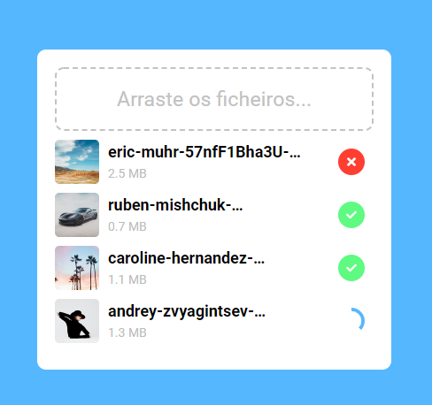

<h1 align="center"> Image Uploader </h1>
<p align="center"> 🚀 Aplicação simples para fazer upload de imagens para um backend 🚀</p>

## :computer: Ferramentas Utilizadas

-  **Node Js** — Contrução da api com a framework ExpressJS 🔨
-  **Vue Js** — Desenvolvimento do Frontend 🔥
-  **Sass** — CSS com superpoderes 😁
-  **MongoDB** — Para guardar informação na base de dados 💾

## 🚀 Tecnologias

Backend:

- [Node.js](https://nodejs.org/en/)
- [MongoDB](https://www.mongodb.com/)
- [Express](https://expressjs.com/pt-br/)
- [Multer](https://github.com/expressjs/multer)
- [Nodemon](https://nodemon.io/)
- [Mongoose](https://mongoosejs.com/)

Frontend:

- [VueJS](https://vuejs.org/)
- [Vue Dropzone](https://rowanwins.github.io/vue-dropzone/docs/dist/#/installation)
- [Font Awesome](https://fontawesome.com/)

## Projeto

Projecto simples de como enviar ficheiros de imagem para o backend/CDN. O objectivo do projecto é apenas para fins educacionais.

## Frontend Preview

<h1 align="center"></img></h1>

## :books: Instalação

### Instalação - Backend

Basta fazer clone do projecto, instalar as dependências e configurar as **variáveis de ambiente**.

```bash
cd backend
npm install
//config .env variables
npm start
```

### Instalação - Frontend (WEB)

Para iniciar o **Frontend** do React utilize os comandos:

```bash
cd aulas
cd frontend
npm install
//config o endpoint
npm serve
```

<p align="center">Feito com 💖 by Eduardo Costa  😍</p>
